# CS 547 Deep Dive Project Final Report

## Team Members

Julian Yu (jiahuan2@illinois.edu)

## Introduction

The goal of this project is to leverage the Deep Learning techniques (Recurrent Neural Network) to explore the potential quantitative relationship between historical and future GPA distribution of UIUC. The raw data (`gpa` directory) of this project is from [University of Illinois' GPA Dataset](https://github.com/wadefagen/datasets/tree/master/gpa).

This project (except the `data` and `gpa` directory) is licensed under the GPLv3 License. See the [LICENSE](LICENSE) file for details. For the `data` and `gpa` directory, follow the guide of [University of Illinois' GPA Dataset](https://github.com/wadefagen/datasets/tree/master/gpa).

**Github Repository**: [https://github.com/monsoon235/CS547-Deep-Dive](https://github.com/monsoon235/CS547-Deep-Dive)

## Data Extraction

`gpa/uiuc-gpa-dataset.csv` is the raw data file. It is a CSV file with 69112 rows and the following columns:

- `Year`: `2010` - `2024`.
- `Term`: `Spring`/`Summer`/`Fall`/`Winter`.
- `YearTerm`: combination of `Year` and `Term`, such as `2024-wi`.
- `Subject`: the subject of the course, such as `CS`, 4155 unique values.
- `Number`: course number, such as `100`, 38527 unique values.
- `Course Title`: strings such as `Data Structures`.
- `Sched Type`: schedule type, such as `LEC`.
- `A+`/`A`/`A-`/`B+`/`B`/`B-`/`C+`/`C`/`C-`/`D+`/`D`/`D-`/`F`: the number of students who got the corresponding grade.
- `W`: the number of students who withdrew from the course.
- `Primary Instructor`: the name of the instructor.

In the `data-extraction.ipynb` file, we read the data from the raw data file, split it into full dataset (69112 rows) and debug dataset (100 rows), and save them to `data/full.pkl` and `data/debug.pkl` respectively.

## Data Exploration

**We give some data visualization, statistics, and analysis in the `data-exploration.ipynb` file.**

### Visualization & Statistics

#### Number of Items by Term

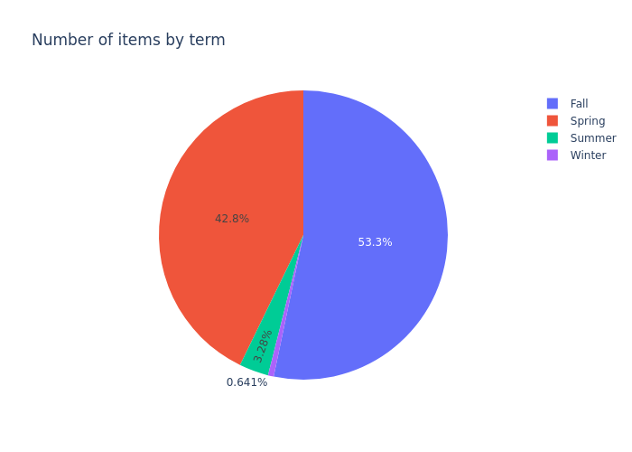

It shows that the items from `Spring` and `Fall` terms contribute the most to the dataset.

#### Number of Items by Year and Term

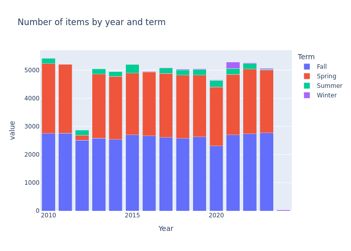

We can see that most of years from `2010` to `2022` keep about the same number of items, except `2012` and `2024`. For `2012`, data of spring term is abnormally less than other years. For `2024`, only a little winter term data is available.

#### Number of Items by Schedule Type

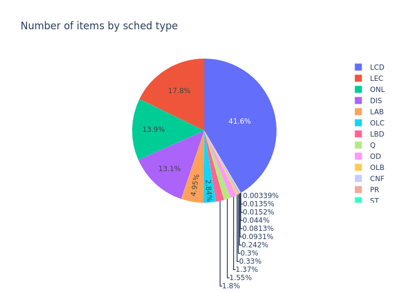

LCD type contributes about 40% of the dataset, followed by LEC, ONL and DIS, which are about 13% ~ 18%. Other types contribute small percentages.

#### Number of Items by Grade

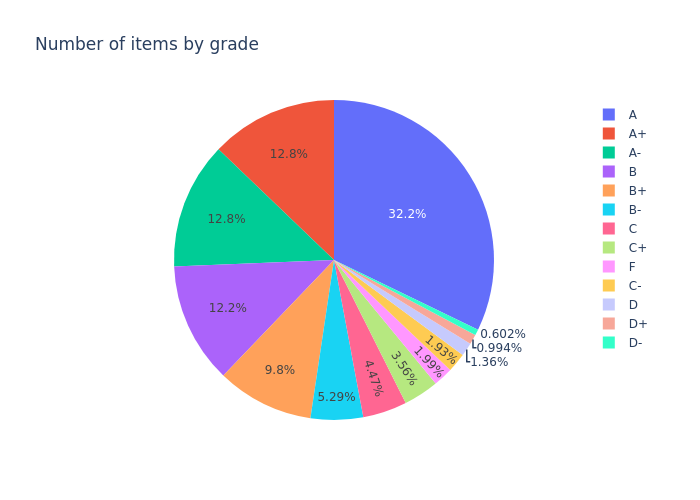

Items with grade `A` contribute about 32% of the whole dataset, followed by `A+`, `A-`, `B`, `B+`, which are about 10% for each. Other grades contribute small percentages.

#### Number of Items by Subject

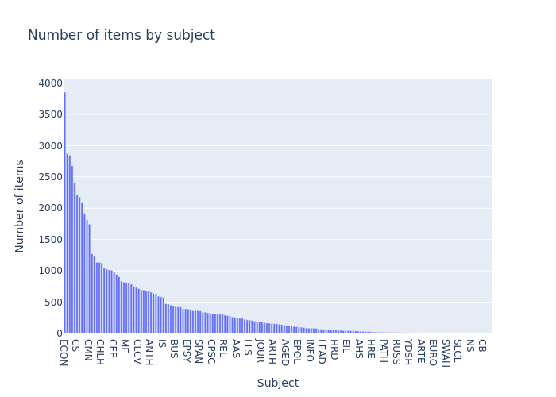

The distribution of items by subject is imbalanced, just like a long-tail distribution. The top 10 subjects contribute about 35% of the dataset.

#### Grade Distribution by Year

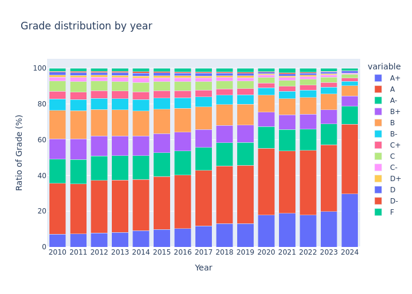

Items with grade `A` contribute the most to the dataset of every year. But percentage of `A` and `A+` increase year by year from `2010` to `2024`, while other grades decrease.

### Missing Data

According to the figure of Number of Items by Year and Term, the item from 2012 spring term is significantly less than springs of other years, which indicates most of the data from 2012 spring term is missing.

### Imbalanced Data

1. The data from 2024 is too few compared to other years. It seems that data of 2024 is still being collected and incomplete.
2. Data from spring and fall terms are much more than winter and summer terms, indicating that the data is imbalanced by term.
3. Top 4 schedule types (`LCD`, `LEC`, `ONL`, `DIS`) contribute about 86.4% of the dataset, while other 14 types contribute only 13.6%. It indicates that the data is imbalanced by schedule type.
4. Top 5 grades (`A+`, `A`, `A-`, `B+`, `B`) contribute about 80% of the dataset, while other 9 grades contribute only 20%. It indicates that the data is imbalanced by grade.
5. When the year is later, the percentage of "good grades" (`A`, `A+`) increases, while the percentage of "bad grades" (`F`) decreases. It indicated there's a sampling bias by year in dataset, or it just reflects the grade inflation in the real world.
6. The distribution of items by subject is imbalanced, just like a long-tail distribution. The top 10 subjects contribute about 35% of the dataset. It indicates that the data is imbalanced by subject.

### Sparse Data

Sparse data (null value) statistics by `data-exploration.ipynb`:

```
Year                      0
Term                      0
YearTerm                  0
Subject                   0
Number                    0
Course Title              0
Sched Type            10051
A+                        0
A                         0
A-                        0
B+                        0
B                         0
B-                        0
C+                        0
C                         0
C-                        0
D+                        0
D                         0
D-                        0
F                         0
W                         0
Primary Instructor      171
```

There's 10051 items which miss the `Sched Type`, which contains about 14.5% of the dataset. Also, there's 171 items which miss the `Primary Instructor` field, which contains about 0.25% of the dataset. It indicates that the data is sparse in these two fields.

## Baseline Learning (Linear Regression)

We use Linear Regression as the baseline learning method. **Our code can be found in `baseline-learning.ipynb`.**

### Data Preprocessing

We use such fields as features and labels:

- **Features**: `Year`, `Term`, `Subject`, `Course Title`, `Number`, `Sched Type` and `Primary Instructor` fields. They are all encoded to numerical encoding by `sklearn.preprocessing.LabelEncoder`.
- **Labels**: the `GPA` of the course, which is calculated by the number of students who got each grade.

Data preprocessing includes:

1. Dropping useless columns: `YearTerm`, `W`.
2. Filtering out items with missing fields (`null` value).
3. Computing `GPA` of each row as label field.
4. Numerical encoding for feature fields: `Year`, `Term`, `Subject`, `Course Title`, `Number`, `Sched Type` and `Primary Instructor`.
5. Splitting features and labels.
6. Splitting train and test dataset (90% : 10%).

After Preprocessing, we get 53023 items in the train dataset and 5892 items in the test dataset.

### Training & Testing

We use `sklearn.linear_model.LinearRegression` as the model. The training process is simple, just calling `fit` method with the train dataset.

We use RMSE (Root Mean Squared Error) as the evaluation metric, just call `sklearn.metrics.root_mean_squared_error` function. **The RMSE of the test dataset is about 0.374.** The following figure shows the distribution of the error of the test dataset:

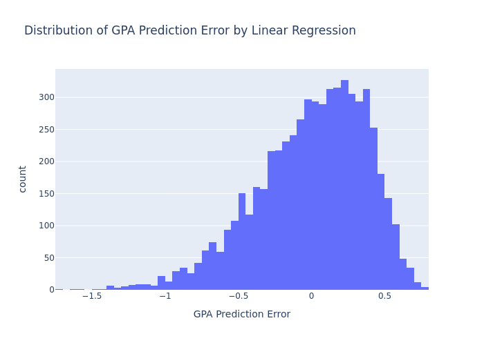

We can see that this model works poorly for the dataset and can not generate any meaningful prediction, which shows the necessity of using Deep Learning techniques.

## Deep Learning (RNN)

Recurrent Neural Network (RNN) is a suitable model for sequence data, and for predicting future data based on historical data. We use RNN as the Deep Learning model for this project, as the goal of this model id to predict future GPA of a course based on historical GPA data.

**Our code can be found in `deep-learning.ipynb`.**

### Data Preprocessing

We preprocess the data to make it more suitable for RNN model.

As the data required by RNN is sequential data, we split the dataset into many sequences. In details, `Number`, `Course Title`, `Subject`, `Primary Instructor`, `Sched Type` fields are used for grouping the data, which means the items with the same values in these fields are grouped together as a sequence. The sequence order is determined by the `Year` and `Term` fields, which means the items are sorted by `Year` and `Term` fields (such as `2010-spring`, `2010-summer`, `2010-fall`, `2011-winter`, ...).

In each sequence we use such fields as features and labels:

- **Features**: `Year` ans `Term` fields are used as features. They are encoded by one-hot encoding, which generate 18 one-hot fields (`Year_2010`, `Year_2011`, `Year_2012`, `Year_2013`, `Year_2014`, `Year_2015`, `Year_2016`, `Year_2018`, `Year_2019`, `Year_2020`, `Year_2021`, `Year_2022`, `Year_2023`, `Year_2024`, `Term_0`, `Term_1`, `Term_2`, `Term_3`). These fields are combined as a 18-dimension vector, as the input of the RNN model. Besides, to enable the model to distinguish different course, we also introduce `course_id` field. Each sequence has a different `course_id`. `course_id` is also the input of the RNN model.
- **Labels**: `GPA` are used as labels.

But such preprocessing, we get **4048 sequences**. The maximum length of the sequences is 335. We filter out the sequences with length less than 5, as they are too short to build meaningful prediction based on historical data. The distribution of the sequence length is shown in the following figure (note that the x-axis is log-scaled):

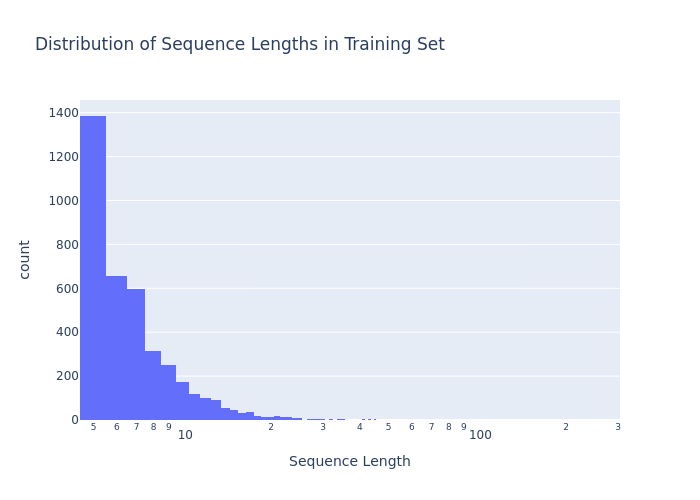

Another important question is how to split the dataset into train and test dataset. Because different sequences have different `course_id`, we can not just simply split the total sequences into two parts. Instead, considering that our goal is to predict future GPA based on historical GPA, we can assume that the user already knows the historical GPA of a course. Based on this assumption, we can split the sequences by time series. In details, for a sequence with length `L`, **we split it into `L-1` historical data and 1 future data**. So the before `L-1` data is used as the train dataset, and the the total sequence with length `L` is used as the test dataset. In training, we compute the loss based on all before `L-1` data, and in testing, only the future data (the last item in the sequence) is used to compute the loss.

Finally, **we use test dataset as also the validation dataset.**

### Model Architecture

We use RNN as the core of our model. The input is a 18-dimension vector (`Year` and `Term` one-hot encoding) and a 1-dimension scalar (`course_id`). The output is a 14-dimension vector (the portion of each grade and `GPA`).

Specifically, our model contains the following parts:

- **Input**: a `torch.nn.Embedding` layer is used to embed the `course_id` to a `embedding_dim`-dimension vector. This vector is concatenated with the 18-dimension `Year` and `Term` one-hot encoding vector, and then passed to the next layer.
- **LSTM**: a `torch.nn.LSTM` layer is used as the core of the model. The input size is `18 + embedding_dim`, and the hidden size is `hidden_size`. A fully connected layer (`torch.Linear`) is used to transform the hidden state to the output (a scalar). `num_layers`, `bias`, `dropout` are the hyperparameters to control the structure of the LSTM.
- **Output**: a `torch.nn.Tanh` layer is used to transform the output to the range of `[0, 1]`. Then it is multiplied by 4.0, as the GPA for output.

In the model architecture, there are some tunable hyperparameters:

- `embedding_dim`: the dimension of the `course_id` embedding vector.
- `hidden_size`: the dimension of the hidden state of the LSTM.
- `num_layers`: the number of layers of the LSTM.
- `bias`: whether to use bias in the LSTM.
- `dropout`: the dropout ratio of the LSTM.

### Loss Function

MSE (Mean Squared Error) is used as the loss function. When training, all outputs in a sequence are used to compute the loss. When testing, only the last output (the "future" data) is used to compute the loss.

### Training & Hyperparameter Tuning

Such hyperparameters are tunable for training: `optimizer`, `learning_rate`, `batch_size`. Also, there are some model architecture hyperparameters tunable: `embedding_dim`, `hidden_size`, `num_layers`, `bias`, `dropout`.

#### Tuning Optimizer

We try both `SGD` and `Adam` optimizer. Other hyperparameters are fixed as `embedding_dim=64`, `hidden_size=64`, `num_layers=10`, `bias=True`, `dropout=0.1`, `learning_rate=1e-05`, `batch_size=32`. The following figure shows the loss of the validation loss by epochs when using different optimizers:

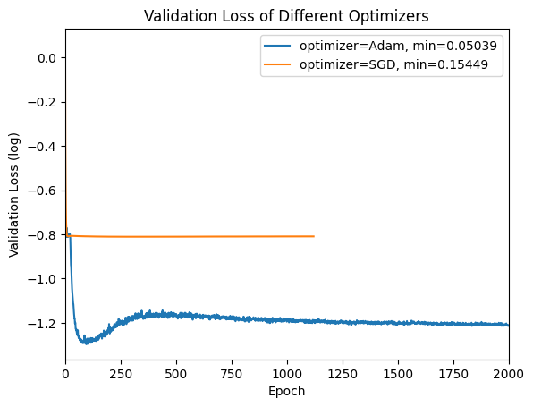

We can see that `SGD` falls into a local minimum, but `Adam` can converge to a much lower loss.

#### Tuning Learning Rate

We try different `learning_rate` values: `0.00001` and `0.0001`. Other hyperparameters are fixed as `embedding_dim=64`, `hidden_size=64`, `num_layers=10`, `bias=True`, `dropout=0.1`, `optimizer=Adam`, `batch_size=32`. The following figure shows the loss of the validation loss by epochs when using different learning rates:

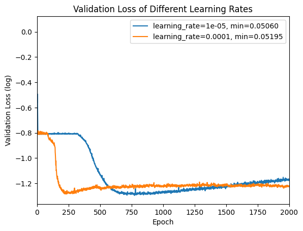

We can see that higher learning rate (`0.0001`) means faster convergence but higher optimal loss. So we choose `0.00001` as the learning rate, to get better model performance.

#### Tuning Batch Size

We try different `batch_size` values: `8`, `16`, `32`, `128`. Other hyperparameters are fixed as `embedding_dim=64`, `hidden_size=64`, `num_layers=10`, `bias=True`, `dropout=0.1`, `optimizer=Adam`, `learning_rate=0.0001`. The following figure shows the loss of the validation loss by epochs when using different batch sizes:

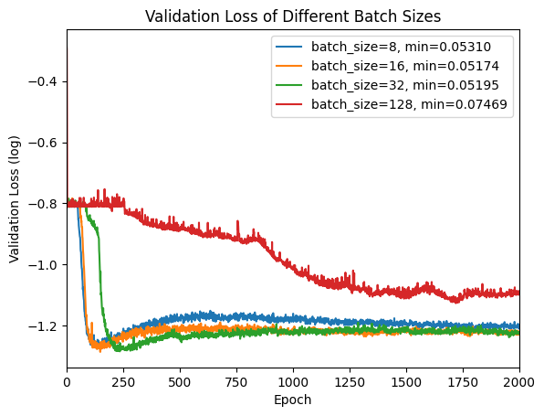

We can see that from `8` to `32`, higher batch size means lower convergence speed but lower optimal loss. But in the case of `128`, the model seems fall into a local minimum. So we choose `32` as the batch size, to get the best model performance.

#### Tuning Embedding Dimension & Hidden Size

We try different `embedding_dim` and `hidden_size` values: `16`, `32`, `64`, `128`, `256`. Other hyperparameters are fixed as `num_layers=10`, `bias=True`, `dropout=0.1`, `optimizer=Adam`, `learning_rate=0.00001`, `batch_size=32`. The following figure shows the loss of the validation loss by epochs when using different embedding dimension and hidden size:

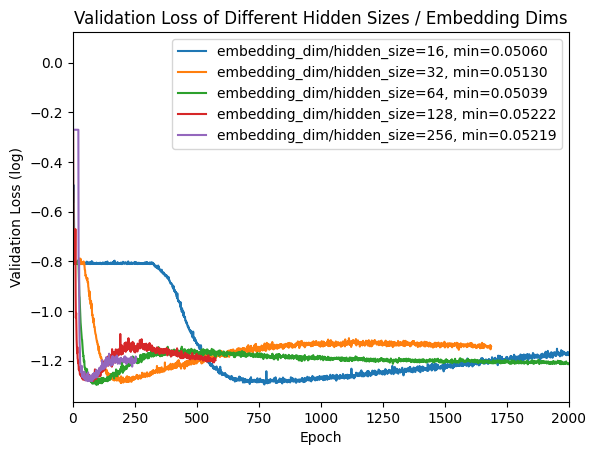

We can see too large `embedding_dim`/`hidden_size` (`128`, `256`) will lead to overfitting, while small `embedding_dim`/`hidden_size` (`16`, `32`, `64`) are enough for this dataset. We choose `64` to balance the model performance and the convergence speed.

#### Tuning Number of Layers

We try different `num_layers` values: `2`, `5`, `7`, `10`. Other hyperparameters are fixed as `embedding_dim=64`, `hidden_size=64`, `bias=True`, `dropout=0.1`, `optimizer=Adam`, `learning_rate=0.00001`, `batch_size=32`. The following figure shows the loss of the validation loss by epochs when using different number of layers:

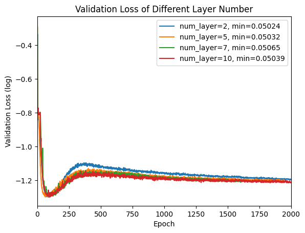

It shows that number of layer does not greatly affect the model performance.

#### Tuning Dropout

We try different `dropout` values: `0.0` (no dropout), `0.1`, `0.2`, `0.3`. Other hyperparameters are fixed as `embedding_dim=64`, `hidden_size=64`, `num_layers=10`, `bias=True`, `optimizer=Adam`, `learning_rate=0.00001`, `batch_size=32`. The following figure shows the loss of the validation loss by epochs when using different dropout values:

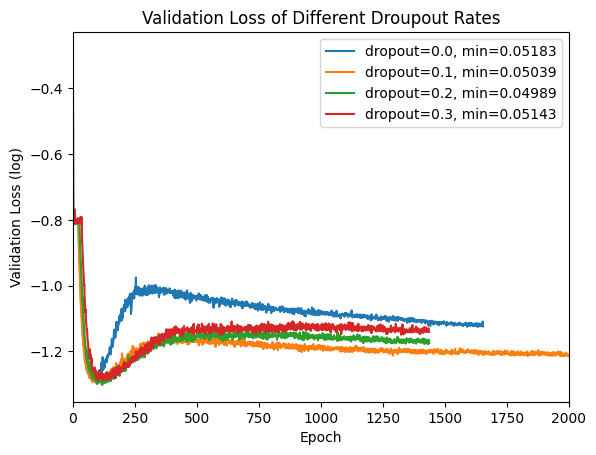

It shows that dropout can greatly reduce the overfitting of the model. But too large dropout (`0.3`) will harm the model performance. We choose `0.2` to balance the model performance and the overfitting prevention.

### Best Hyperparameters Combination

By tuning result, we get a combination of best hyperparameters: `embedding_dim=64`, `hidden_size=64`, `num_layers=10`, `bias=True`, `dropout=0.2`, `optimizer=Adam`, `learning_rate=0.00001`, `batch_size=32`.

With this hyperparameters combination, the model can converge to **MSE loss about 0.049892**. The GPA prediction error is shown as the following figure:

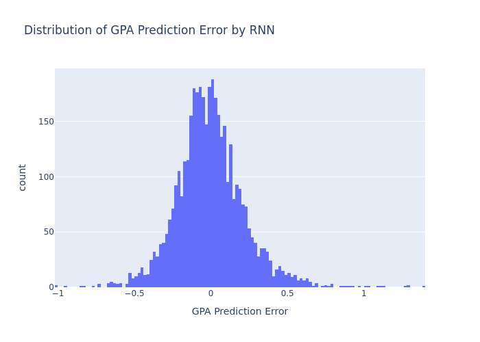

## Feature Importance

To analyze the feature importance, we permute each feature field respectively, and compute the MSE difference between the permuted input the non-permuted input. The code can be found in `feature-importance.ipynb`.

We use the model checkpoint with hyperparameter `embedding_dim=64`, `hidden_size=64`, `num_layers=10`, `bias=True`, `dropout=0.2`, `optimizer=Adam`, `learning_rate=1e-05`, `batch_size=32`. The MSE loss of non-permuted input is 0.049892. The following table shows the MSE difference of each feature field:

| Permuted Feature | MSE Difference |
| :--------------: | :------------: |
|   `course_id`    |    0.20358     |
|   `Year_2010`    |    0.00039     |
|   `Year_2011`    |    0.00032     |
|   `Year_2012`    |    0.00033     |
|   `Year_2013`    |    0.00012     |
|   `Year_2014`    |    0.00012     |
|   `Year_2015`    |    0.00006     |
|   `Year_2016`    |    0.00001     |
|   `Year_2018`    |    0.00071     |
|   `Year_2019`    |    0.00034     |
|   `Year_2020`    |    0.00034     |
|   `Year_2021`    |    0.00060     |
|   `Year_2022`    |    0.00100     |
|   `Year_2023`    |    0.00164     |
|   `Year_2024`    |    0.00000     |
|     `Term_0`     |    0.00003     |
|     `Term_1`     |    0.00031     |
|     `Term_2`     |    0.00005     |
|     `Term_3`     |    0.00037     |

We can see that if permute `course_id`, the MSE will dramatically increase, while if permute other fields, the MSE will not change too much. It indicates that `course_id` is the most important feature field in our trained RNN model, and other fields are not so important.

The importance of `course_id` shows that the GPA of a course is **self-exciting**: in the same course, the future GPA is highly related to the historical GPA.

## Conclusion

This project shows that:

1. The UIUC GPA is self-exciting.
2. Future GPA can be predicted based on historical data by a RNN.
